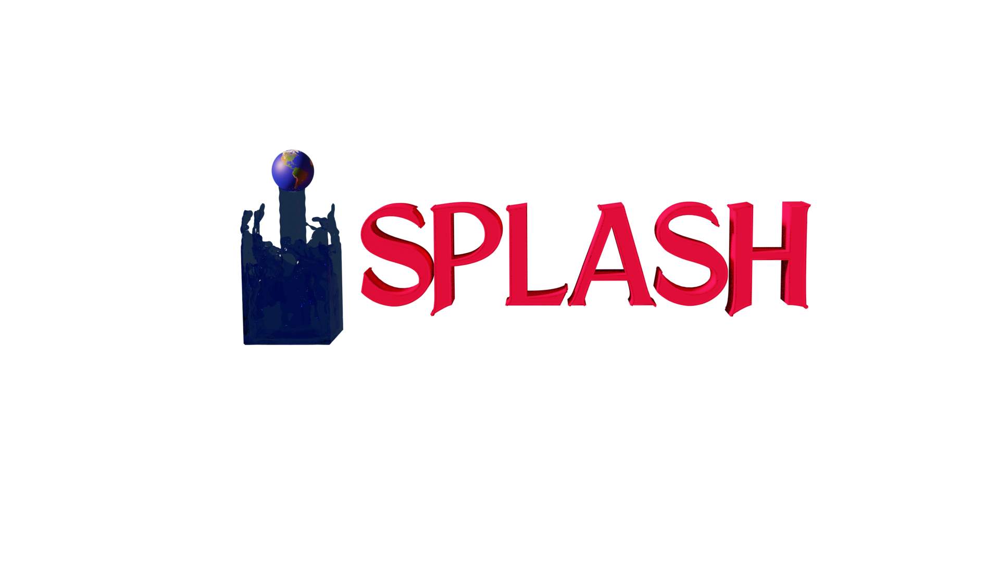

# 

## Developers
Prajwal Niraula, Lionel Garcia, Alex Quach

## Email:
prajwalniraula@gmail.com, lionel.garcia@student.uliege.be

## Additional Team Members:
Julien de Wit, Artem Burdanov, Benjamin Rackham 

# Description
SPLASH (Speculoos PLAnet SearcH) is a module that works with cambridge products in order to detect planets. SPLASH is powered by SVD, and it finds the best basis vector that explains the trend in data while preserving box like transit shapes. Current version is meant to work with old/new version of SPECULOOS Cambridge Pipeline products. Also it is meant to work with TRAPPHOT products. SPLASH also utilizes multiprocessing if resources are available to improve the speed of the algorithm.

The stable version of the code resides at https://github.com/disruptiveplanets/SPLASH, whereas the code is activately being developed at  https://github.com/prajwal309/Splash

SPLASH creates following subfolders within the output directory:
- DailyBestCases: Diagnostic plots for  containing the best case fit for each night.
- Data: contains the pickled data from each run
- Outliers: If data is pre-cleaned, which is recommended, outliers are shown for each night in this folder
- Periodogram: Periodograms from either "TLS" or "TransitMatching" algorithm.
- MCMC_Results: If MCMC results are run, resulting fits results are located here.

# Future development:
- Algorithm are constantly being imrove.A more robust and faster transit matching algorithm is being build.
- A completeness test will be performed using the algorithm.
